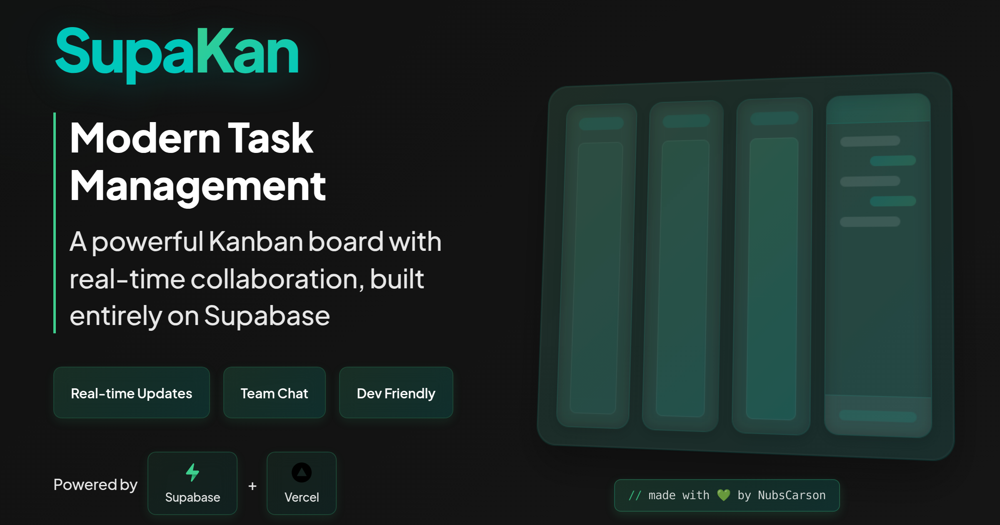

# Kanban Board

A modern, feature-rich Kanban board application built with React and TypeScript. Experience seamless task management with real-time chat, powerful analytics, and a beautiful dark mode interface.



## ✨ Features

### Task Management
- 📋 Intuitive drag-and-drop task management across columns (Backlog, Todo, In Progress, In Review, Done)
- 📝 Rich text editor with formatting, mentions, and file attachments
- 🏷️ Customizable task labels and priority levels
- 📅 Due dates and time estimation tracking
- 🎫 Automatic ticket ID generation for easy reference
- 🔍 Advanced task filtering and search capabilities

### Team Collaboration
- 💬 Real-time chat with message threading
- 👥 @mentions and notifications
- 📌 Pin important messages
- 👍 Message reactions and likes
- 🔗 Link tasks in conversations

### Analytics & Monitoring
- 📊 Real-time task distribution analytics
- ⏱️ Task completion time tracking
- 📈 Team productivity metrics
- 🔄 System health monitoring
- 💡 Insights dashboard

### Modern UI/UX
- 🌓 Beautiful dark/light mode with system preference sync
- 🎨 Modern design using Tailwind CSS and shadcn/ui
- 📱 Fully responsive layout
- ⚡ Fast and smooth animations
- 🖼️ Social media preview cards

## 🛠️ Tech Stack

- **Frontend Framework**: React 18 with TypeScript
- **Build Tool**: Vite
- **Styling**: Tailwind CSS + shadcn/ui
- **State Management**: React Context + Custom Hooks
- **Data Storage**: IndexedDB
- **Rich Text Editor**: TipTap
- **Drag and Drop**: react-beautiful-dnd
- **Routing**: React Router DOM
- **Form Handling**: React Hook Form + Zod
- **Icons**: Lucide React
- **Date Handling**: date-fns

## 🚀 Getting Started

1. Clone the repository:
   ```bash
   git clone https://github.com/NubsCarson/kanban.git
   cd kanban
   ```

2. Install dependencies:
   ```bash
   npm install
   ```

3. Start the development server:
   ```bash
   npm run dev
   ```

4. Open [http://localhost:5173](http://localhost:5173) in your browser.

## 📖 Usage

### Task Management
- Create tasks with rich descriptions, due dates, and priorities
- Drag and drop tasks between columns to update status
- Use the rich text editor to add formatted content, lists, and code blocks
- Attach labels for better organization
- Set time estimates and track progress

### Chat System
- Start conversations in the chat panel
- @mention team members to notify them
- Pin important messages for quick access
- React to messages with likes
- Link tasks in conversations for context

### Analytics
- Monitor task distribution across columns
- Track completion rates and team performance
- View system health metrics
- Analyze chat engagement statistics

## 🛠️ Development

```bash
# Run development server
npm run dev

# Type checking
npm run typecheck

# Linting
npm run lint

# Build for production
npm run build

# Preview production build
npm run preview

# Clean build files
npm run clean
```

## 🔧 Configuration

The application supports various configuration options through environment variables:

```env
VITE_APP_NAME=Kanban Board
VITE_APP_URL=http://localhost:5173
```

## 🤝 Contributing

We welcome contributions! Please follow these steps:

1. Fork the repository
2. Create a feature branch: `git checkout -b feature/amazing-feature`
3. Commit your changes: `git commit -m 'feat: add amazing feature'`
4. Push to the branch: `git push origin feature/amazing-feature`
5. Open a pull request

## 📝 License

This project is licensed under the MIT License - see the [LICENSE](LICENSE) file for details.

## 🙏 Acknowledgments

- [shadcn/ui](https://ui.shadcn.com/) - Beautiful UI components
- [TipTap](https://tiptap.dev/) - Powerful rich text editor
- [react-beautiful-dnd](https://github.com/atlassian/react-beautiful-dnd) - Smooth drag and drop
- [Tailwind CSS](https://tailwindcss.com/) - Utility-first CSS framework
- [Vite](https://vitejs.dev/) - Next generation frontend tooling
- [Radix UI](https://www.radix-ui.com/) - Unstyled, accessible components

## 🌟 Support

If you find this project helpful, please consider giving it a star ⭐️

Visit the live demo at [https://kanban.nubs.site](https://kanban.nubs.site) 